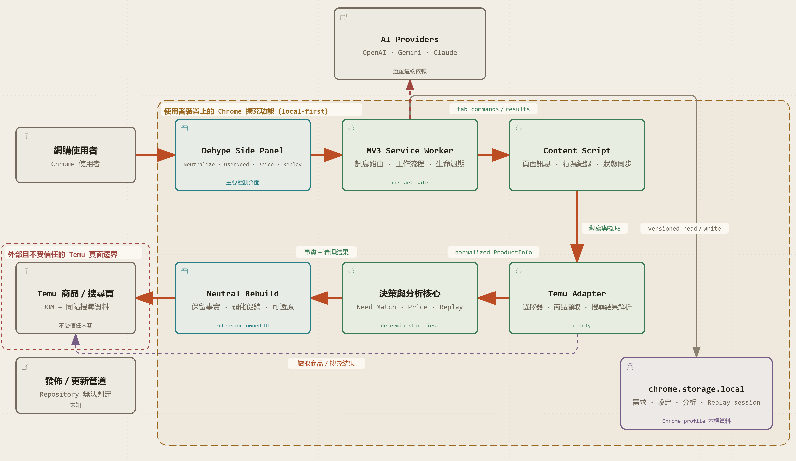

# Dehype

## 問題與目標

如今的網購頁面充斥著促銷、倒數等煽動性文案，誘導消費者做出非理性的購買決策。現有解方多在抑制使用者的衝動，而我們旨在弱化網頁施加的暗示。

一款隨插即用的瀏覽器插件 -- Dehype 因此誕生。

Dehype 移除或弱化商品頁面中的煽動性資訊，保留原排版，重新聚焦於商品本身。並整合：價格比對、購買意圖提醒及選購過程中的行為紀錄。再透過 LLM 分析歷史行為與決策脈絡，協助使用者在做出決定前重新審視其合理性。

Dehype 不過度干涉，僅降低環境對決策的干擾，讓 AI 成為一個安靜的輔助者。

## 核心功能

Dehype 從四個面向優化使用者的選購流程：
- Neutralize：移除或弱化商品頁面中的煽動性資訊，保留原排版，重新聚焦於商品本身
- UserNeed：使用者輸入預算、需求與偏好，時刻提醒最初的購買意圖
- Price Comparing：一鍵搜尋相似商品，繪製價格長條圖，取得最高、最低、中位數
- Analysis：紀錄選購期間歷史行為，梳理決策脈絡，在做出決定前重新審視其合理性


## 系統架構



``` plaintext
Dehype/
├── AGENTS.md                               # 產品原則、MVP 範圍與架構規範
├── README.md                               # 專案現況、功能與開發方式
├── package.json                            # 建置、測試及檢查指令
├── extension/
│   ├── manifest.json                       # Chrome MV3 權限、入口與支援網域
│   ├── img/
│   │   └── Dehype.png
│   └── src/
│       ├── sidepanel/
│       │   ├── index.html                  # Side Panel 主畫面結構
│       │   ├── main.ts                     # 功能切換、狀態同步與主要互動
│       │   ├── sidepanel.css               # Side Panel 共用視覺設計
│       │   ├── decisionReplay.html         # Decision Replay 畫面
│       │   ├── decisionReplay.js           # Replay 資料載入與呈現
│       │   └── decisionReplay.css
│       ├── background/
│       │   ├── background.ts               # Service Worker 與訊息協調中心
│       │   ├── neutralizeWorkflow.ts       # Neutralize 分析流程
│       │   ├── needMatchWorkflow.ts        # UserNeed 比對流程
│       │   ├── aiProvider.ts               # OpenAI、Gemini、Claude 串接
│       │   ├── decisionReplayStorage.js    # Replay session 本機持久化
│       │   └── decisionReplayAnalysis.js   # Replay AI 分析
│       ├── content/
│       │   ├── index.ts                    # Temu 頁面操作與可逆式重建
│       │   └── decisionReplayRecorder.ts   # 瀏覽與商品互動事件紀錄
│       ├── adapters/
│       │   ├── productAdapter.ts           # 零售網站 Adapter 共用介面
│       │   ├── temuProductAdapter.ts       # Temu 商品資料與促銷元素擷取
│       │   └── temuSearchAdapter.ts        # Temu 搜尋結果與價格資料擷取
│       └── shared/
│           ├── productInfo.ts              # 正規化商品資料與訊息契約
│           ├── userNeed.ts                 # 使用者需求資料模型
│           ├── needMatch.ts                # 需求比對結果與狀態
│           ├── priceComparison.ts          # 價格統計邏輯
│           ├── decisionReplay.ts           # Replay domain model
│           ├── decisionTrace.ts            # 決策歷程與 Attention Share
│           ├── aiSettings.ts               # AI 設定、同意與權限管理
│           └── tabActions.ts               # Side Panel 對分頁的安全操作
├── tests/
│   └── ...                                 # Adapter 與核心流程測試
├── website/
│   └── ...                                 # Dehype 展示網站
└── ...
```
```

## 使用技術

| 類型 | 技術／服務 | 用途 |
| --- | --- | --- |
| AI 模型 | OpenAI、Google Gemini、Anthropic Claude（可選） | 商品文句中性化與需求契合分析 |
| 前端 | TypeScript、HTML/CSS、Chrome Extension Manifest V3 | 擴充功能介面、Temu 頁面重建與使用者操作 |
| 後端 | Chrome MV3 Service Worker、Vite、Node.js | 訊息路由、分析工作流程、打包與建置 |
| 資料儲存 | `chrome.storage.local` | 本機保存設定、需求、分析與決策回放資料 |
| 測試 | Vitest、JSDOM、ESLint、TypeScript | 單元測試、DOM 整合測試、型別與程式碼檢查 |

## 安裝與執行

### 1. 環境需求

- macOS、Windows 或 Linux
- Node.js `22.13.x`，且版本需小於 `23`
- npm
- Chrome 或其他支援 Manifest V3 的 Chromium 瀏覽器

### 2. 安裝依賴與驗證

```sh
git clone https://github.com/ilsao/Dehype.git
cd Dehype
npm ci
npm run lint
npm test
npm run typecheck
npm run build
```

`npm run build` 會執行型別檢查、Vite 打包與 extension manifest 驗證，並在 `dist/` 產生未封裝的 Chrome extension。

### 3. 載入 Chrome 擴充功能

1. 開啟 `chrome://extensions`。
2. 開啟右上角的 **Developer mode**。
3. 選擇 **Load unpacked**。
4. 指定專案產生的 `dist/` 資料夾。
5. 開啟 Temu 商品詳細頁（網址需符合 `-g-<id>.html` 形式），再從 Dehype popup 手動執行 **Neutralize** 或開啟 Side Panel。

AI 分析不是必要條件。若要啟用，請在 popup 選擇 provider、輸入模型名稱與自己的 API key，閱讀並勾選資料傳送同意後儲存設定。API key 僅存於本機 Chrome profile，未加密，請勿在截圖、提交或公開展示中暴露。

### 4. （選用）啟動展示網站

展示網站位於 `website/`，與 Chrome extension 的執行環境分開：

```sh
cd website
npm install
npm run dev
```

## 作品展示

- 作品展示網址：[https://ilsao.github.io/Dehype/](https://ilsao.github.io/Dehype/)
- 評選影片：尚未提供

## 限制與未來工作

目前已知限制：
- DOM 結構可能變更；adapter 已提供 selector fallback，但仍可能需要維護。
- AI 需要使用者自行提供 API key，且遠端分析結果受 provider 可用性、模型輸出與網路狀態影響；失敗時只能使用結構化清理或顯示錯誤。
- 價格比較以目前頁面中可抽取的商品資訊為限，若頁面中缺少價格、幣別或欄位的商品可能無法納入。
- `chrome.storage.local` 適合目前的本機資料量，尚未提供跨裝置同步或遠端帳號。
- Decision Replay 目前僅跑通資料流程及實現程式功能。最初目的是希望作為使用者購物所受影響之分析的統計依據，但因為沒有相關心理學理論或實驗支持所以不能作為有效的統計判斷。不過此功能或許可以當作相關研究的工具。
- 尚未提供正式 Chrome Web Store 發布流程、完整跨瀏覽器相容性測試與正式版使用者遙測。

後續發展方向：

- 完成可解釋的 Decision Delta 分數與理由展示，保持「事實、需求落差、估計」分層。
- 擴充 Temu adapter 的語系、變體、運費、配送、賣家與評論欄位測試。
- 完善 Decision Replay 的事件模型與不確定性表達，避免把相關性描述成個人因果證明。
- 在明確的隱私與同意邊界下，研究本機 Personalized Decision Defense；不以阻止結帳或替使用者做決定為目標。
- 補足鍵盤操作、錯誤恢復、service worker 重啟與完整手動流程的整合測試。

## 第三方服務、資料與素材

| 項目 | 來源／連結 | 授權或使用方式 |
| --- | --- | --- |
| Chrome Extensions API | [Chrome Extensions Documentation](https://developer.chrome.com/docs/extensions/) | Google 官方文件與瀏覽器平台 API；依 Chrome 平台條款使用 |
| OpenAI API | [OpenAI Platform](https://platform.openai.com/docs/) | 使用者自備 API key、同意後選用；依 OpenAI 條款與政策使用 |
| Google Gemini API | [Gemini API Documentation](https://ai.google.dev/gemini-api/docs) | 使用者自備 API key、同意後選用；依 Google API 條款使用 |
| Anthropic Claude API | [Claude API Documentation](https://docs.anthropic.com/en/api/getting-started) | 使用者自備 API key、同意後選用；依 Anthropic 條款使用 |
| React、Vite、TypeScript、Vitest、ESLint | 各專案官方網站與 npm 套件資訊 | 依各套件個別開源授權使用，詳見套件 metadata |
| `lucide-react` | [Lucide](https://lucide.dev/) | ISC License |
| Dehype 圖示 | `extension/img/Dehype.png` | 專案素材；未使用外部個人資料或生產環境頁面截圖 |

## 團隊成員

| 姓名 | 分工 |
| --- | --- |
| 羅晨恩 | 總工程師、CICD、產品需求、架構設計、使用者流程與整合規劃 |
| 鄭宇勛 | LLM API串接、Userneeds 與 Side Panel |
| 陳姝安 | 架構設計、網頁爬蟲、adapter、productComparision |
| 何家睿 | neutralizer、DecisionReplayer、Website |
| 章繼綸 | 產品需求、插件UI、Icon Design、文件與展示素材 |

## License

本專案採用 [MIT License](LICENSE)。完整授權條款請見儲存庫根目錄的 `LICENSE` 檔案。
